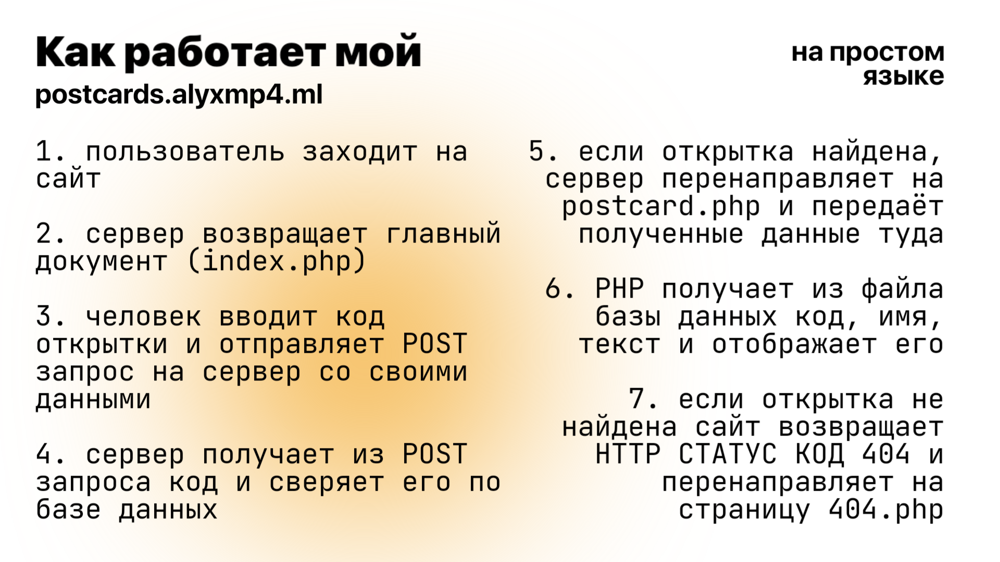
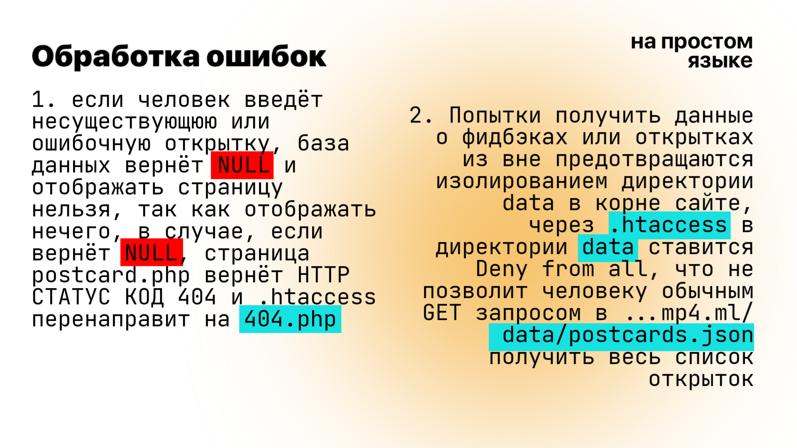

## Сайт для отображения открыточек, и поиск этих открыток по их коду 


> Это лишь очень маленький фановый школьный проект, наша школа на днях устраивала мероприятие где все могли оставить свои открыточки с посланиями на бумажке и их доставят до его адресата, Я решил поместить в маленькую открыточку весь текст и пожелание для людей в полном размере без ограничений и попрактиковаться по кодингу, и решил написать свой сайт, вы можете затестить его по [ссылке](https://postcards.alyxmp4.ml)

Выше предоставлены весь исходный код этого сайта, ниже о требованиях

## Требования к запуску
- Вам нужно иметь хоть каплю представления о том, как работает интернет
- У вас должно быть представление о PHP, HTML
- У вас должен быть работающий сервер Apache с PHP версии 8

## О принципе работы



### Что происходит на `index.php`

1. Человек заходит на сайт и на главной странице его ждёт форма с записью кода открытки
2. Человек вводит и нажимает на кнопку *Поиск*, если говорить уровню ниже, человек вводит форму HTML, форма настроена таким образом: 
> - При нажатии на кнопку
```html
<button type="submit"></button>
```
 человек отправляет форму\
> - Форма отправляет POST запрос
```html
<form method="POST" action="./postcard.php"></form>
```
На страницу `postcard.php` с введёнными данными

### Что происходит на `postcard.php`

3. Страница `postcard.php` получает с отправленных данных введённый код
```php
<?php
 $data = file_get_contents("./data/postcards.json"); // get file content to read list of postcards
 $string = json_decode($data, true); // decode all data
 ...
?>
```

3.1. Если введённого кода не существует, страница перенаправляет на страницу `404.php` и возвращает соответствующюю ошибку
```php
if (is_null($string[$_POST["code"]])) {
    http_response_code(404); // set response code to 404, it means that page is not found
    include("err/404.php"); // include out 404 file to show
    die(); // exit website process
 } // check if code is in our data, if not redirect too 404 error page
```

4. Страница получает с `postcards.json` нужную запись и выводит её на сайт
```php
...
            <h1 class="display-5 fw-bold">
              <?php 
              print($string[$_POST["code"]]["NAME"]) // get name of the postcard owner by their code from our data from postcards.json
              ?>
            </h1>
...

```

5. В случае если человек захочет ввести свою обратную связь, мнение о сайте он опять вводит форму
```html
<form action="./thanks.php" method="post" class="... id="feedback">
```
6. Когда пользователь нажимает на кнопку
```html
<button class="..." type="submit" style="margin-top: 16px;">Отправить</button>
```
Все введённые данные отправляются на страницу `thanks.php`

### Что происходит в `thanks.php`

7. Если человек решил потроллить и отправлять пустую строку вместо фидбэка сайт решит послать его... перенаправить на главную страницу
```php
<?php
  
  if (is_null($_POST["feedback"])) {
    header("Location: https://postcards.alyxmp4.ml"); // for that mfs who think that they can just enter example.com/thanks.php to crush website ahahhaa not in my site
    die();
  }

```

8. Если всё нормально, сайт получит файл feedback.json и введёт туда все нужные данные полученные от пользователя
8.1. Обозначим куда сохранять файл переменной `$path`

```php
  $path = "./data/feedback.json"; // enter path for file you want to keep feedbacks in
```

8.2. Создадим массив с данными которые нужно сохранить в наш файл и завернём всё в переменную `$data`
```php
 $data = [
    "ip" => $_SERVER['REMOTE_ADDR'], // get IP address of that person, huh, if u need actually, don't forget to warn person ant it btw
    "user-agent" => $_SERVER['HTTP_USER_AGENT'], // the same way with user agent, just why not
    "text" => $_POST["feedback"] // and ofc text of feedback
  ];
```

8.3. И наконец сформируем все данные и запишем их в `feedback.json`
```php
  $current_data = file_get_contents($path); // read file of feedbacks
  $array_data = json_decode($current_data, true); // decode all data to make php get wth is it gonna do
  $array_data[] = $data; // you know what
	$final_data = json_encode($array_data, JSON_UNESCAPED_UNICODE, JSON_PRETTY_PRINT); // print all data to json format and write it prettier, yk what, prettier <3
  file_put_contents($path, $final_data) // write ur json file for sure yeesss
```

##Обработка ошибок



> 1. Если искомой страницы, как, например, ...mp4.ml/несуществующяя-страница не будет существовать, по правилам заданные в  `.htaccess` вас перенаправит на `404.php`
```
ErrorDocument 404 /err/404.php
```
> 2. Если человек попытается обычным GET запросом получить все данные лежащие в директории `data`, (там хранятся все открытки с кодами и обратные связи людей) ему выведет ошибки об отсутствии доступа (403), файл `.htaccess` внутри директории `data`
```
Deny from all
ErrorDocument 403 /err/403.php
```
> 3. Если искомая пользователем открытка окажется либо ошибочной, либо несуществующей сайт выведет `404.php` и вернёт `HTTP STATUS CODE 404`
```php
...
 if (is_null($string[$_POST["code"]])) {
    http_response_code(404); // set response code to 404, it means that page is not found
    include("err/404.php"); // include out 404 file to show
    die(); // exit website process
 } // check if code is in our data, if not redirect too 404 error page
 ...
```

## На этом всё!! Спасибо за внимание :)